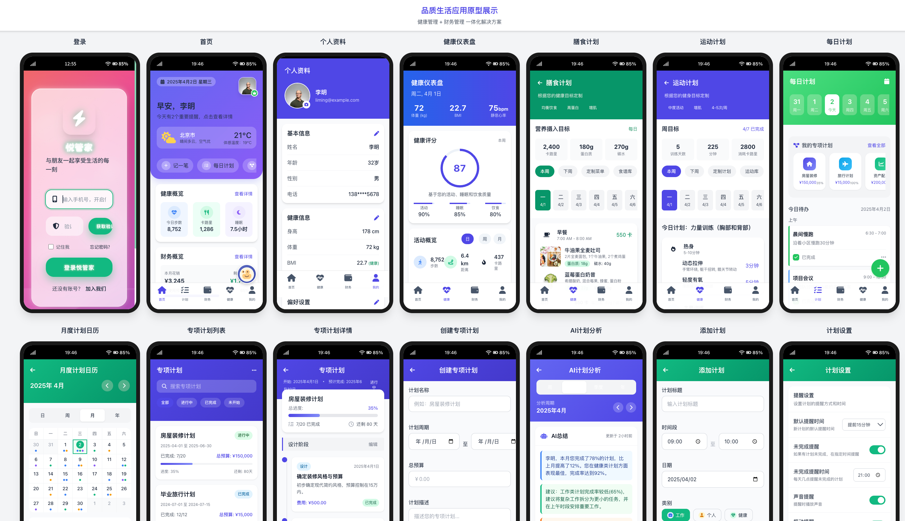

# 悦管家（Health App）

面向家庭场景的 **健康管理 + 记账与预算 + 日程计划** 应用。本仓库包含 **Flutter 跨端客户端**、**Go 语言后端 API**，以及一套 **Web 静态原型页面**（HTML/CSS/JS），便于对照功能与迭代设计。

## 应用展示

以下为客户端实际运行效果截图（图片文件位于仓库根目录：`image.png`、`image copy.png`）。

<p align="center">
  
  &nbsp;&nbsp;
  
</p>

---

## 功能概览

- **账户与安全**：手机号短信验证码登录、JWT 鉴权与刷新（具体以服务端实现为准）
- **家庭与成员**：家庭成员管理、家庭维度财务视图
- **财务**：收支记录、交易历史、家庭财务汇总、预算与分类、储蓄目标
- **计划**：日计划 / 月计划、专项计划与阶段、计划分析与提醒（客户端含本地通知与后台任务相关逻辑）
- **智能助手与「AI」展示**：见下文「与 AI / 智能助手相关」一节。
- **其他**：个人资料、网络诊断入口等（以实际代码为准）

> 说明：开源版本请自行配置数据库、短信、对象存储等外部服务；未配置时部分功能可能不可用或使用 Mock 行为。

---

## 与 AI / 智能助手相关

本项目中与「AI」相关的部分，**侧重产品交互与界面形态**；当前仓库**未内置**大语言模型推理服务，也**未默认接入** OpenAI、通义、文心等第三方 API。若你要在开源或私有部署中启用真实 AI，需要自行增加服务端接口、密钥配置与合规审查。

### Flutter 客户端（`life_app`）

| 能力 | 说明 | 代码位置（便于二次开发） |
|------|------|-------------------------|
| **小财助手** | 财务场景对话助手「小财」：主界面浮窗进入聊天页，支持快捷建议标签与文本输入；**回复逻辑为本地关键词规则 + 模拟延迟**，用于演示对话流，**非**真实模型生成。 | `lib/widgets/assistant/assistant_chat_screen.dart`、`assistant_floating_button.dart` |
| **计划分析 · AI 总结** | 计划分析页中的「AI总结」区块（信息 / 建议 / 注意等卡片），**当前为静态示例文案**，用于展示版式；接入真实 AI 后可改为拉取后端分析结果或流式内容。 | `lib/screens/plan/analysis/widgets/ai_summary_section.dart` |

语音输入等入口在界面中预留为「即将上线」类提示，尚未实现。

### Web 静态原型（`ui/`）

- `ui/js/assistant.js`：页面级「智能助手」浮窗与聊天容器、模拟对话流程。
- `ui/pages/assistant.html` 等页面：与助手相关的原型布局与交互。

与 Flutter 端类似，原型侧**不依赖**后端 AI 服务，便于单独改视觉与交互。

### 扩展建议（供贡献者参考）

- 在后端增加统一「对话 / 分析」接口，客户端改为 `http`/`dio` 调用；密钥与模型路由仅放在服务端。
- 将记账、计划完成率等**脱敏统计**作为上下文，再调用大模型或自建小模型，并注意用户隐私与地区法规。

---

## 仓库结构

```
health_app/
├── life_app/          # Flutter 客户端（iOS / Android / Web 等）
├── life_app_back/     # Go + Gin 后端 API
├── ui/                # 静态页面原型（Tailwind 等），非必须运行项
└── android/           # 根目录 Android 相关资源（若存在，请以 Flutter 子工程为准）
```

---

## 技术栈

| 部分 | 技术 |
|------|------|
| 客户端 | Flutter 3.x、Dart 3.x、`provider`、HTTP（`dio` / `http`）、图表（`fl_chart`）、本地通知、`workmanager` 等 |
| 后端 | Go 1.20+、[Gin](https://github.com/gin-gonic/gin)、GORM、MySQL、Redis、JWT、Viper 配置、[阿里云 OSS SDK](https://github.com/aliyun/aliyun-oss-go-sdk)（若启用上传） |
| 原型 | HTML、CSS、JavaScript |

---

## 环境要求

### 后端

- Go **1.20+**
- **MySQL** 5.7+（或兼容版本）
- **Redis** 6.0+

### 客户端

- Flutter SDK（与 `life_app/pubspec.yaml` 中 `environment.sdk` 一致，当前为 `>=3.0.5 <4.0.0`）
- Xcode / Android Studio 等，按目标平台准备

---

## 快速开始

### 1. 克隆仓库

```bash
git clone <你的仓库地址>
cd health_app
```

### 2. 启动后端

```bash
cd life_app_back
go mod download
```

1. 从示例生成配置文件（**不要**提交真实 `config.*.yaml`）：

   ```bash
   cd life_app_back/config
   cp config.dev.yaml.example config.dev.yaml
   # 编辑 config.dev.yaml，填入你的 MySQL / Redis / JWT / OSS 等
   ```

   详见 [`life_app_back/README.md`](life_app_back/README.md)。仓库根目录 `.gitignore` 已忽略本地配置文件。
2. 支持通过环境变量覆盖配置（详见 `life_app_back/README.md`），例如以 `LIFEAPP_` 为前缀的变量。
3. 在 `life_app_back` 目录下运行（入口为根目录的 `main.go`）：

```bash
APP_ENV=dev go run main.go
```

若子目录文档仍写有 `cmd/api/main.go`，以当前仓库中实际存在的 `main.go` 为准。

开发环境默认服务端口在配置文件中为 **8082**（若你已修改端口，请与客户端保持一致）。

### 3. 启动 Flutter 客户端

```bash
cd life_app
flutter pub get
```

将客户端指向本地 API：在 `life_app/lib/constants/api_constants.dart` 中把环境设为 **local**（或等价修改 `baseUrl`），使 `baseUrl` 与后端地址、端口一致。生产环境默认占位为 `https://api.example.com`，部署后请改为你自己的域名。

```bash
# 示例：在 Chrome 上运行
flutter run -d chrome

# 示例：打 Android 发布包
flutter build apk --release
```

### 4.（可选）查看静态原型

用浏览器打开 `ui/index.html` 或各 `ui/pages/*.html` 即可本地预览，无需单独编译。

---

## 配置说明摘要

- **后端**：多环境通过 `APP_ENV` 等切换；敏感信息建议使用环境变量注入，并在公开仓库中使用占位符或私有配置。
- **客户端**：API 根地址、超时等在 `life_app/lib/constants/api_constants.dart` 中维护。

---

## 参与贡献

欢迎 Issue 与 Pull Request。建议：

1. 先搜索是否已有相同问题或讨论。
2. 提交代码前在本地运行 `go test ./...`（后端）与 `flutter analyze` / 测试（客户端）。
3. 一次 PR 聚焦一个主题，说明动机与主要变更。

---

## 开源许可

若你尚未选择许可证，可自行添加根目录 `LICENSE` 文件（例如 MIT、Apache-2.0 等），并在此处替换本节说明。**在确定许可证前，请勿默认允许他人任意商用或闭源衍生。**

---

## 免责声明

本软件按「**原样**」提供，作者不对使用本软件造成的任何直接或间接损失承担责任。涉及健康、财务等决策请以专业机构或正式产品为准，本仓库代码仅供学习与交流。

---

## 开源前安全提示

若仓库历史上曾提交过真实数据库密码、OSS、JWT 等，**在公开到 GitHub 前请轮换所有相关密钥**，并考虑使用 `git filter-repo` / BFG 等工具清理历史（公开后历史中的密文仍可能被检索）。

## 相关文档

- 后端更详细的配置与运行说明：[`life_app_back/README.md`](life_app_back/README.md)
- Flutter 工程说明：[`life_app/README.md`](life_app/README.md)
